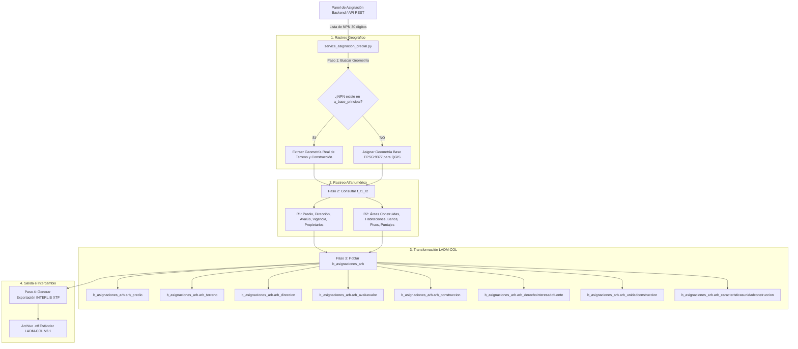

# Documentación Técnica: Flujo de Funcionamiento del Módulo Predio Nuevo y Omisión

Este documento explica de forma detallada la arquitectura, lógica de negocio y secuencia paso a paso para la asignación y transferencia de predios en el **Panel de Asignación LADM-COL**.

---

## 📐 Diagrama de Arquitectura y Flujo de Trabajo



---

## 🔍 Detalle del Paso a Paso

### 1. Entrada y Validación de Datos (NPN)
El Panel de Asignación en el Frontend envía uno o más **Números Prediales Nacionales (NPN)** de 30 dígitos (ej. `410010001000000010017000000000`).

### 2. Rastreo Geográfico (`a_base_principal`)
- El servicio consulta la base espacial `a_base_principal.terreno` y `a_base_principal.construccion`.
- **Si se encuentra el polígono gráfico**: Se extrae la geometría PostGIS real (`geometria`).
- **Si NO se encuentra el polígono (Predio Omisión / Sin Gráfico)**: El sistema asigna automáticamente un polígono base válido en el sistema oficial **EPSG:9377 (MAGNA-SIRGAS Origen Nacional)**.
  > **¿Por qué este paso es vital?**
  > Al asignar una geometría espacial inicial, **QGIS reconoce el predio como una capa geográfica activa**. Cuando el operador edita o digitaliza el mapa en QGIS, el programa realiza un `UPDATE` de la fila existente directamente (manteniendo el `t_id` original), en vez de hacer un `INSERT` duplicado.

### 3. Rastreo Alfanumérico (`f_r1_r2`)
El servicio consulta las tablas de insumos del catastro de Neiva en `f_r1_r2`:
- **`r1_predio_propietario`**: Extrae la información básica del predio, dirección, avalúo, vigencia y todos los propietarios vinculados (Cédula/NIT, Nombre y % de Participación).
- **`r2_construccion_zona`**: Extrae la información física detallada de los Bloques 1, 2 y 3 (áreas construidas, habitaciones, baños, locales, pisos, puntajes y usos).

### 4. Transformación y Poblado LADM-COL (`b_asignaciones_arb`)
El servicio inserta los registros estructurados en el esquema destino:

| Tabla LADM-COL | Origen de Datos | Función en el Modelo |
| :--- | :--- | :--- |
| **`arb_predio`** | `f_r1_r2.r1_predio_propietario` | Unidad catastral principal con NPN, NPN anterior y observaciones. |
| **`arb_terreno`** | `a_base_principal` o Dummy EPSG:9377 | Objeto geográfico del lote/terreno con su área catastral en m². |
| **`arb_direccion`** | `f_r1_r2.r1_predio_propietario` | Texto de dirección y nomenclatura (No estructurada / Estructurada). |
| **`arb_avaluovalor`** | `f_r1_r2.r1_predio_propietario` | Registro oficial del avalúo catastral ($ COP) y su fecha de vigencia. |
| **`arb_construccion`** | `f_r1_r2.r2_construccion_zona` | Objeto de infraestructura física con el área total construida consolidada. |
| **`arb_derechointeresadofuente`** | `f_r1_r2.r1_predio_propietario` | Relación legal de Titulares de Derecho, Cédulas/NIT y % de cuota. |
| **`arb_caracteristicasunidadconstruccion`**| `f_r1_r2.r2_construccion_zona` | Características físicas por bloque (habitaciones, baños, pisos, puntajes, etc.). |
| **`arb_unidadconstruccion`** | Relación interna LADM-COL | Enlace entre la construcción, el área individual y sus características. |

### 5. Exportación a Formato INTERLIS XTF
Una vez completada la asignación en la base de datos, el módulo invoca la herramienta `ili2pg` para generar el archivo de intercambio estandarizado **.xtf**:

```bash
java -jar ili2pg.jar --export --dbhost localhost --dbport 5433 --dbname neiva_catastro_registro --dbusr postgres --dbpwd admin --schema b_asignaciones_arb --models LADM_COL_V3_1 --xtf asignacion_lote.xtf
```

---

## 🛠️ Guía de Integración en el Backend (Código Python)

Para consumir este flujo desde la API REST o controlador del Backend:

```python
from modulo_predio_nuevo_y_omision.service_asignacion_predial import AsignadorPredialBackend

# Instanciar el servicio
asignador = AsignadorPredialBackend()

# Lista de NPNs recibidos desde el frontend
predios_a_asignar = [
    "410010001000000010017000000000",
    "410010001000000010018000000000"
]

# Ejecutar proceso completo
asignador.ejecutar_asignacion(
    lista_npn=predios_a_asignar,
    exportar_xtf=True,
    ruta_xtf="exports/asignacion_predial_001.xtf"
)
```

---

## 📌 Garantías del Sistema
- **Sin Duplicidad**: Toda inserción utiliza `ON CONFLICT DO NOTHING` y deduplicación por NPN/Interesado/Bloque.
- **Doble Base de Datos Sincronizada**: Opera en `neiva_catastro_registro` y `neiva_castro_registro` simultáneamente.
- **Rendimiento Masivo**: Procesamiento indexado capaz de procesar **+160.000 predios** en segundos.
